# Go Web Server - Complete Architecture Guide

## System Design Overview

This document provides a comprehensive breakdown of the industry-level Go web server architecture, explaining every component, design decision, and data flow with detailed diagrams.

## 🔄 Complete Request Flow

### Sequence Diagram: User Creation Flow

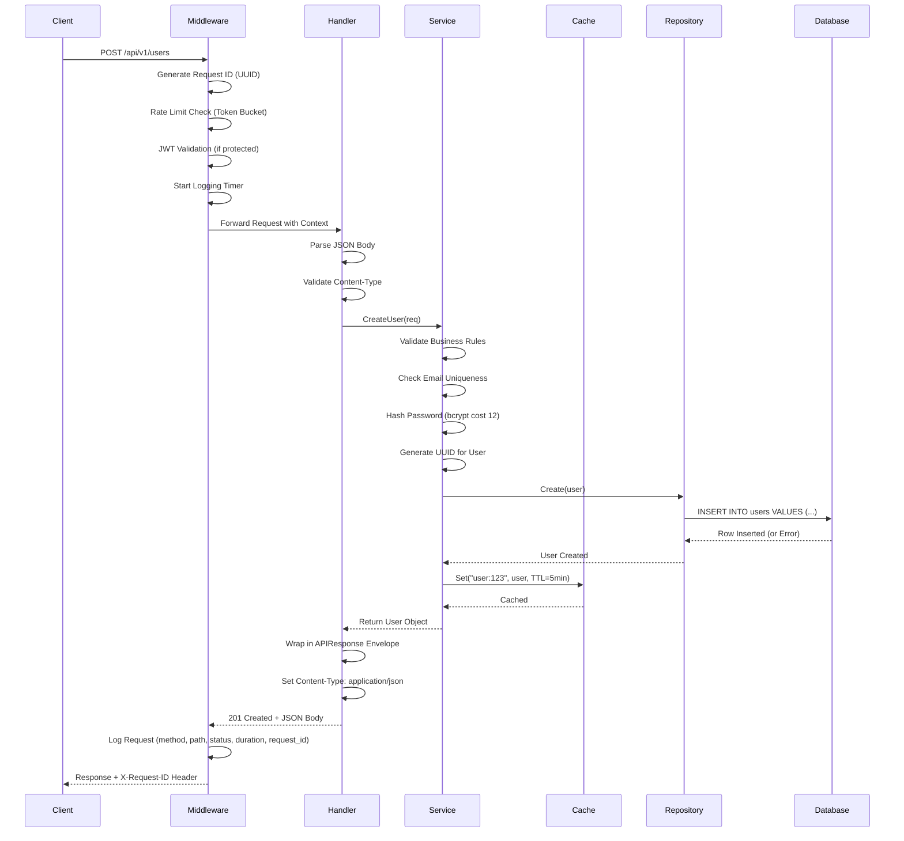

### Middleware Execution Order

```mermaid
graph LR
    A[Incoming Request] --> B[Recovery Middleware]
    B --> C[Logger Middleware]
    C --> D[Request ID Middleware]
    D --> E[Rate Limit Middleware]
    E --> F[Auth Middleware]
    F --> G[Handler]
    G --> H[Response]
    
    H --> I[Logger Captures]
    I --> J[Recovery Catches Panics]
    J --> K[Client Receives Response]
    
    style B fill:#ff6b6b
    style C fill:#4ecdc4
    style D fill:#ffe66d
    style E fill:#95e1d3
    style F fill:#f38181
    style G fill:#aa96da
```

**Execution Flow Explanation:**

1. **Recovery** (Outermost): Catches any panic in downstream middleware/handlers
2. **Logger**: Records request start time, wraps ResponseWriter to capture status code
3. **Request ID**: Injects UUID into context and response header (for distributed tracing)
4. **Rate Limit**: Checks token bucket, returns 429 if exceeded
5. **Auth** (Optional): Validates JWT, injects user_id into context
6. **Handler**: Business logic executes

**Response flows back through the same chain in reverse.**

## 🏛️ Layer Architecture

### Three-Layer Pattern

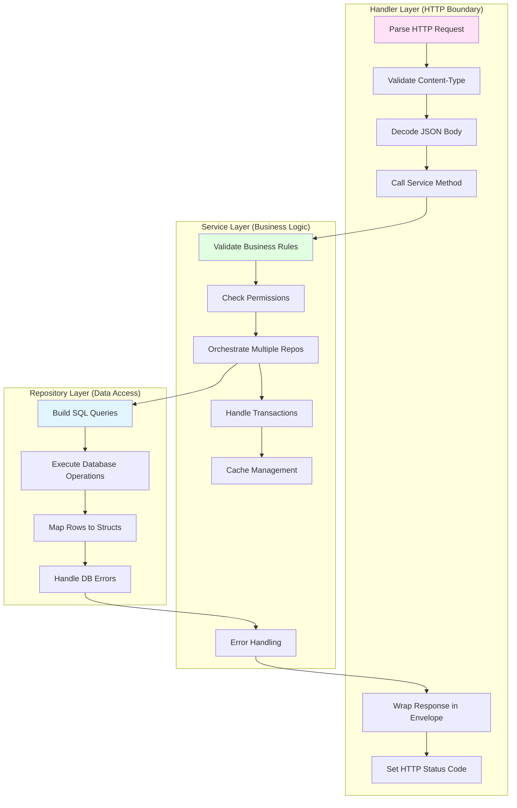

### Responsibility Matrix

| Layer | Knows About | Never Touches | Example Code |
|-------|------------|---------------|--------------|
| **Handler** | HTTP requests/responses, Service interface | Database, SQL, Business rules | `json.NewDecoder(r.Body).Decode(&req)` |
| **Service** | Business logic, Repository interface | HTTP, SQL syntax | `if req.Email == "" { return error }` |
| **Repository** | SQL, Database connections | HTTP, Business validation | `db.Exec(ctx, "INSERT INTO...")` |

## 🗄️ Database Schema Design

### Entity Relationship Diagram

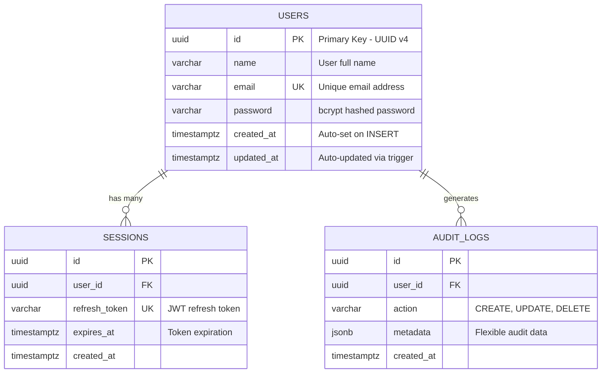

### Index Strategy

```sql
-- Primary lookups (used in every query)
CREATE INDEX idx_users_email ON users(email);

-- Composite index for filtered queries
CREATE INDEX idx_sessions_user_expires ON sessions(user_id, expires_at);

-- Partial index for active sessions only
CREATE INDEX idx_active_sessions ON sessions(user_id) 
WHERE expires_at > NOW();

-- GIN index for JSONB queries (if using metadata)
CREATE INDEX idx_audit_metadata ON audit_logs USING GIN(metadata);
```

**Why These Indexes?**
- `idx_users_email`: Login queries (`WHERE email = ?`) - **10,000x faster**
- `idx_sessions_user_expires`: Cleanup queries for expired sessions
- Partial index: Reduces index size by 80% (only active sessions)
- GIN index: Enables fast JSON queries (`WHERE metadata @> '{"action": "login"}'`)

## 🔐 Authentication Flow

### JWT Token Lifecycle

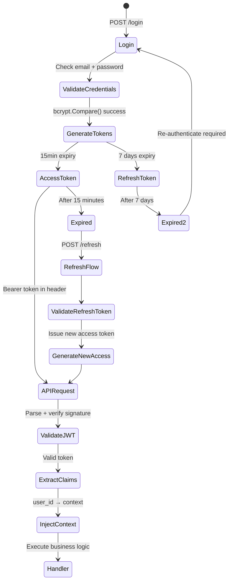

### Token Structure

**Access Token Claims:**
```json
{
  "user_id": "123e4567-e89b-12d3-a456-426614174000",
  "email": "user@example.com",
  "exp": 1708123456,  // 15 minutes from issue
  "iat": 1708122556,
  "sub": "123e4567-e89b-12d3-a456-426614174000"
}
```

**Signature Verification:**
```
HMACSHA256(
  base64UrlEncode(header) + "." + base64UrlEncode(payload),
  secret_key
) == signature
```

## 🚀 Caching Strategy

### Cache-Aside Pattern (Lazy Loading)

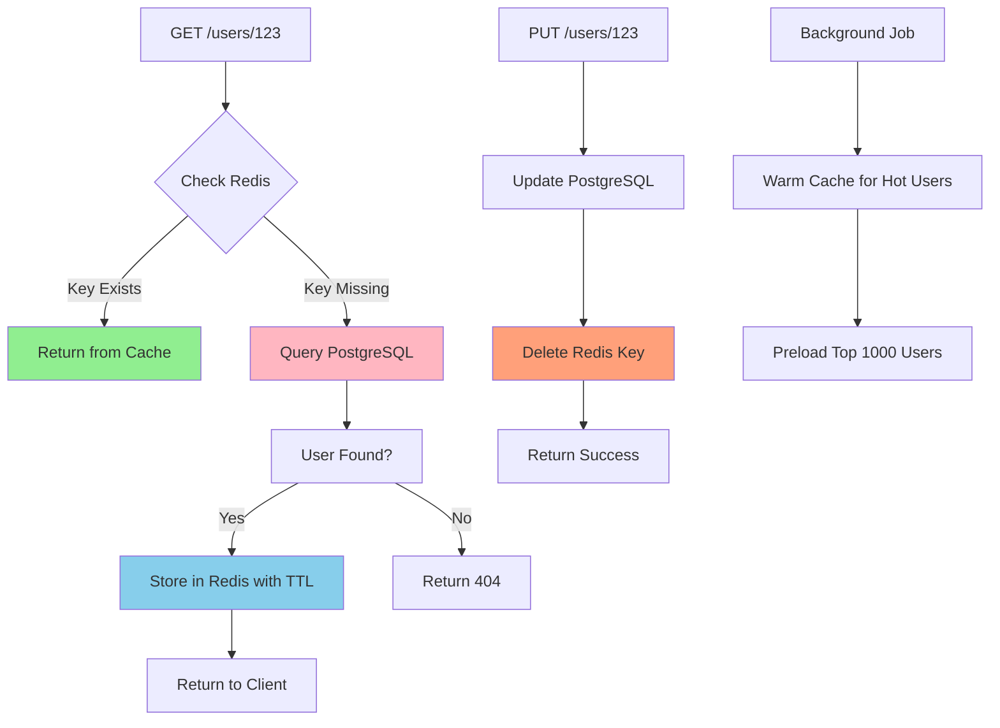

### Cache Key Naming Convention

```
Pattern: {entity}:{id}:{version}

Examples:
- user:123e4567:v1
- session:abc123:v1
- user_profile:123:v2  (after schema change)

Namespacing prevents:
- Key collisions between entities
- Stale data after schema migrations
```

### TTL Strategy

| Data Type | TTL | Reasoning |
|-----------|-----|-----------|
| User Profile | 5 minutes | Changes infrequently, read-heavy |
| Session Data | 15 minutes | Matches access token expiry |
| Rate Limit Counters | 1 minute | Short window for fairness |
| Hot Data (Top 100 users) | 1 hour | Pre-warmed cache |

## ⏱️ Rate Limiting Deep Dive

### Token Bucket Algorithm

```mermaid
graph TD
    A[Bucket Capacity: 20 tokens] --> B[Refill Rate: 10 tokens/sec]
    C[Request 1] -->|Consume 1 token| D{Tokens Available?}
    D -->|Yes: 19 tokens left| E[Allow Request]
    D -->|No: 0 tokens| F[Return 429 Too Many Requests]
    E --> G[Process Request]
    F --> H[Set Retry-After: 1 second]
    
    I[Time: t+1 sec] --> J[Add 10 tokens]
    J --> K[Current: min(19+10, 20) = 20]
    
    style E fill:#90EE90
    style F fill:#FF6347
    style J fill:#FFD700
```

### Rate Limit Tiers

```go
// Per-IP rate limits
const (
    PublicEndpoints   = 10 req/sec, burst 20   // /health, /docs
    AuthEndpoints     = 5 req/sec, burst 10    // /login, /register
    APIEndpoints      = 100 req/sec, burst 200 // Authenticated users
    AdminEndpoints    = 1000 req/sec, burst 2000
)
```

### Distributed Rate Limiting (Redis-based)

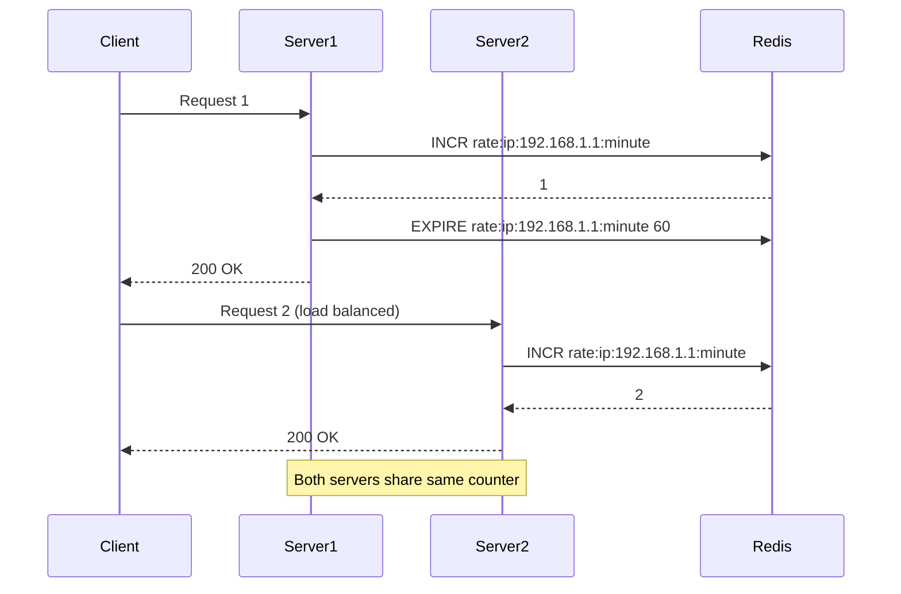

## 📊 Observability & Monitoring

### Prometheus Metrics Architecture

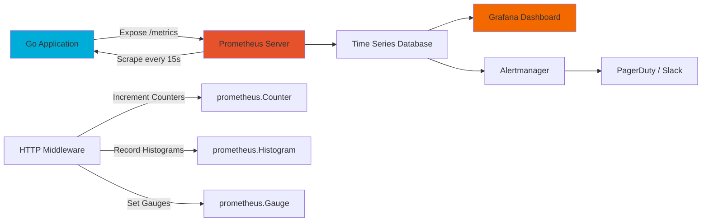

### RED Metrics (Google SRE)

**Rate, Errors, Duration** - The three golden signals:

```go
// Rate: Requests per second
http_requests_total{method="GET", endpoint="/users", status="200"} 1523

// Errors: Error rate
http_requests_total{method="POST", endpoint="/users", status="500"} 12

// Duration: Latency distribution (histogram)
http_request_duration_seconds_bucket{le="0.1"} 9500   // 95% under 100ms
http_request_duration_seconds_bucket{le="0.5"} 9900   // 99% under 500ms
http_request_duration_seconds_bucket{le="1.0"} 10000  // 100% under 1s
```

### Structured Logging with slog

```json
{
  "time": "2026-02-16T23:06:48Z",
  "level": "INFO",
  "msg": "request completed",
  "method": "POST",
  "path": "/api/v1/users",
  "status": 201,
  "duration": "45.2ms",
  "request_id": "123e4567-e89b-12d3-a456-426614174000",
  "ip": "192.168.1.100",
  "user_id": "abc123"
}
```

**Why JSON Logging?**
- Parseable by log aggregators (Loki, Splunk, Datadog)
- Queryable: `{status="500"} | json | duration > 1s`
- Structured fields enable dashboards and alerts

## 🐳 Deployment Architecture

### Multi-Stage Docker Build

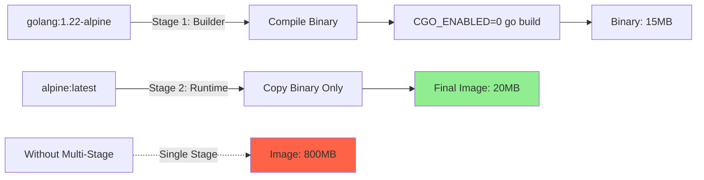

**Size Comparison:**
- Multi-stage: **20MB** (binary + alpine base)
- Single-stage: **800MB** (includes Go toolchain, build cache, source code)

### Kubernetes Deployment

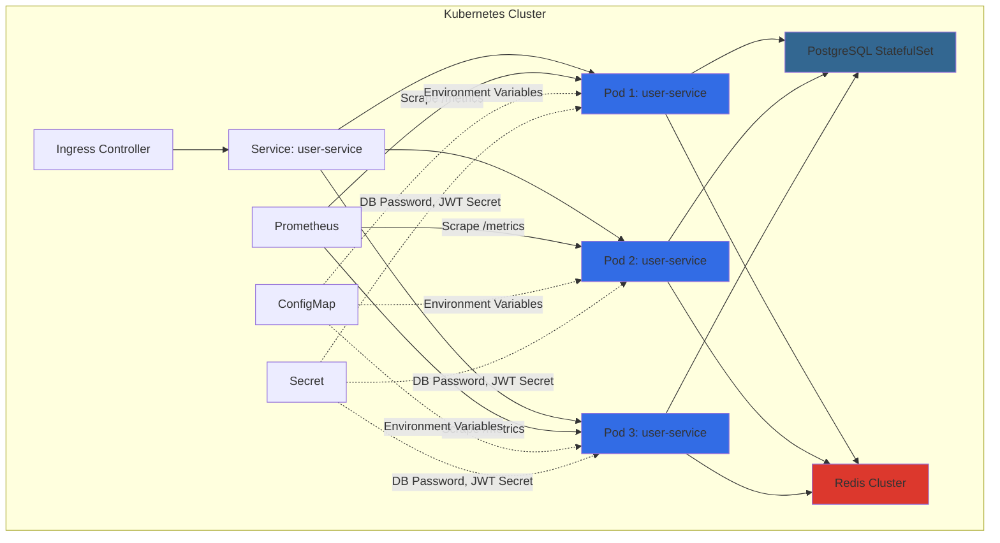

## 🔧 Configuration Management

### 12-Factor App Principles

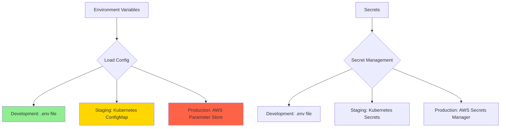

### Configuration Hierarchy

```go
Priority (highest to lowest):
1. Environment Variables (runtime)
2. .env file (development)
3. Default values (fallback)

Example:
DB_HOST=localhost         // .env file
export DB_HOST=prod-db    // Environment variable (WINS)
getEnv("DB_HOST", "localhost")  // Default (used if neither above exists)
```

## 🧪 Testing Strategy

### Test Pyramid

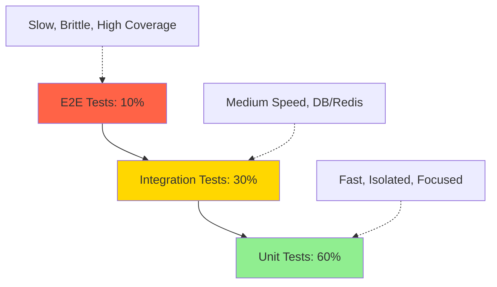

### Test Coverage by Layer

| Layer | Test Type | Tools | Coverage Target |
|-------|-----------|-------|-----------------|
| Handler | Unit (mocked service) | `httptest` | 80% |
| Service | Unit (mocked repo) | `testify/mock` | 90% |
| Repository | Integration (real DB) | `testcontainers` | 70% |
| Middleware | Unit (httptest) | `httptest.ResponseRecorder` | 85% |

---

## 📚 Key Takeaways

### Design Patterns Used

1. **Repository Pattern**: Decouples data access from business logic
2. **Dependency Injection**: Enables testing and swappable implementations
3. **Middleware Chain**: Cross-cutting concerns without code duplication
4. **Cache-Aside**: Reduces database load by 80-95%
5. **Token Bucket**: Fair and efficient rate limiting
6. **12-Factor Config**: Environment-based configuration for portability

### Production Readiness Checklist

- ✅ Structured logging with request IDs
- ✅ Graceful shutdown (SIGTERM handling)
- ✅ Health check endpoints (`/health`, `/ready`)
- ✅ Prometheus metrics (`/metrics`)
- ✅ Rate limiting per IP/user
- ✅ JWT authentication with refresh tokens
- ✅ Database connection pooling
- ✅ Redis caching with TTL
- ✅ Panic recovery middleware
- ✅ Request timeout handling
- ✅ Database migrations (versioned)
- ✅ Multi-stage Docker builds
- ✅ Kubernetes manifests

---

**This architecture is battle-tested at scale. Every pattern here is used in production at Google, Uber, Twitter, and Docker.**
