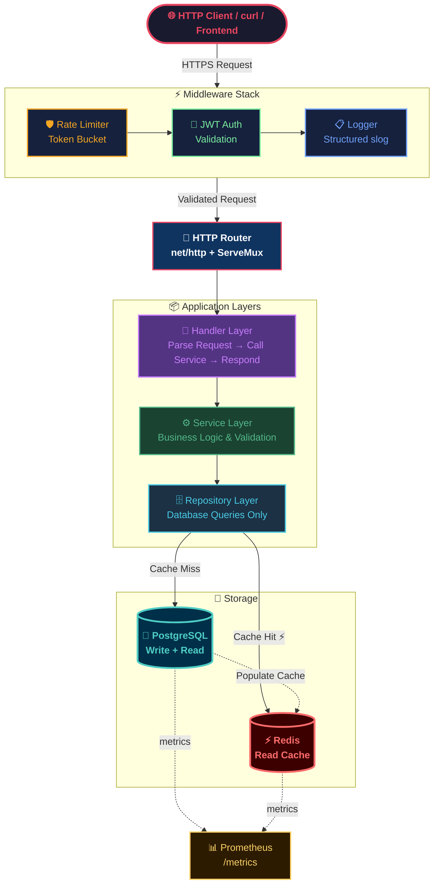
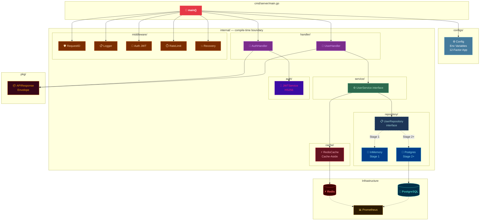
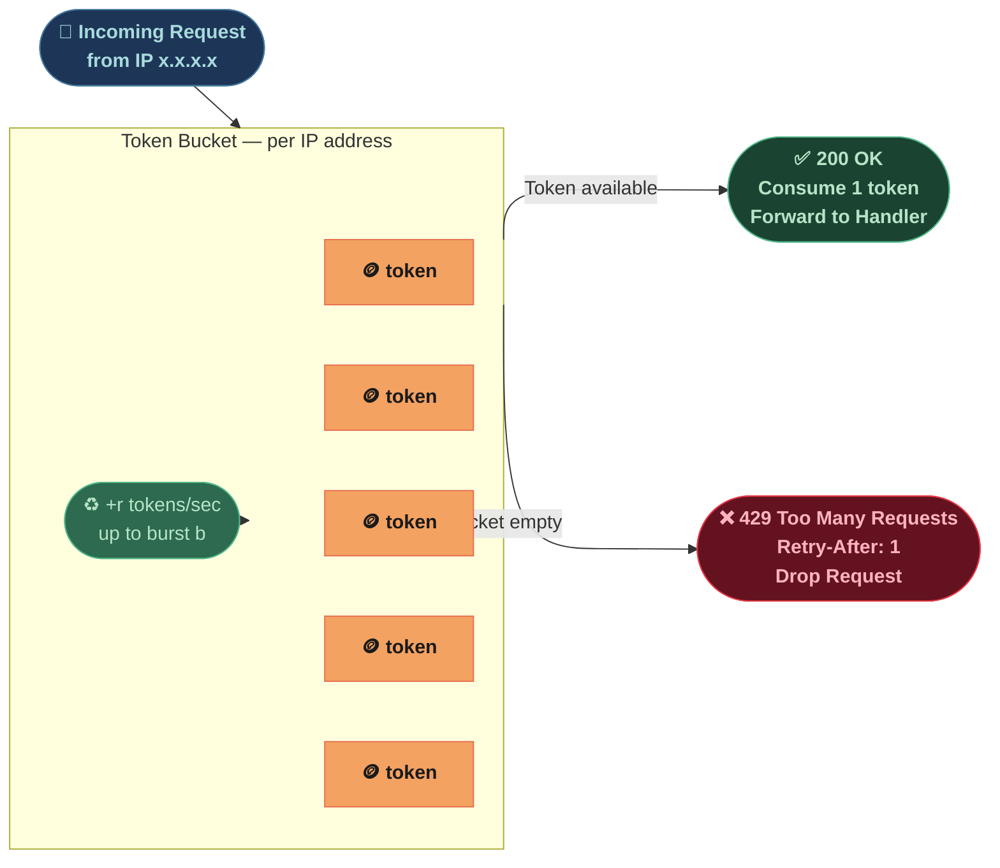

# ⚡ GoForge — Production API Blueprint

> **One project. Nine stages. From `main.go` to something engineers at Google, Uber, and Docker would actually respect.**

[](https://go.dev)
[](https://postgresql.org)
[](https://redis.io)
[](https://prometheus.io)
[](https://docker.com)
[](https://jwt.io)

---

## 🗺️ System Architecture — Full Request Flow



---

## 🏗️ Nine Stages — Build Progression

```mermaid
flowchart LR
    S1["1\n🌱 Basic HTTP\nServer\n---\nnet/http\nslog\nMiddleware"]:::s1
    S2["2\n🐘 CRUD\nPostgreSQL\n---\npgx/v5\nMigrations\nConn Pool"]:::s2
    S3["3\n🔐 JWT\nAuth\n---\nbcrypt\nToken Pairs\nMiddleware"]:::s3
    S4["4\n⚡ Redis\nCaching\n---\nCache-Aside\nTTL\nInvalidation"]:::s4
    S5["5\n🛡️ Rate\nLimiting\n---\nToken Bucket\nPer-IP\nRedis Sync"]:::s5
    S6["6\n🐳 Docker\nCompose\n---\nMulti-Stage\nOrchestration\nDev Env"]:::s6
    S7["7\n🪂 Graceful\nShutdown\n---\nos.Signal\nContext\nDrain"]:::s7
    S8["8\n🧪 Testing\n---\nUnit Tests\nIntegration\nMock Repos"]:::s8
    S9["9\n📊 Prometheus\nMetrics\n---\n/metrics\nHistograms\nGauges"]:::s9

    S1 --> S2 --> S3 --> S4 --> S5 --> S6 --> S7 --> S8 --> S9

    classDef s1 fill:#2d6a4f,stroke:#52b788,stroke-width:2px,color:#b7e4c7
    classDef s2 fill:#1d3557,stroke:#457b9d,stroke-width:2px,color:#a8dadc
    classDef s3 fill:#4a1942,stroke:#c77dff,stroke-width:2px,color:#e0aaff
    classDef s4 fill:#641220,stroke:#e63946,stroke-width:2px,color:#ffb3c1
    classDef s5 fill:#7b2d00,stroke:#f4a261,stroke-width:2px,color:#ffd8b1
    classDef s6 fill:#023e8a,stroke:#0096c7,stroke-width:2px,color:#90e0ef
    classDef s7 fill:#283618,stroke:#606c38,stroke-width:2px,color:#dda15e
    classDef s8 fill:#370617,stroke:#f48c06,stroke-width:2px,color:#faa307
    classDef s9 fill:#3a0ca3,stroke:#7209b7,stroke-width:2px,color:#f72585
```



---

## 📐 Dependency Injection and Layer Flow



---

## 🗄️ Read vs Write Data Flow

```mermaid
sequenceDiagram
    participant C as 🌐 Client
    participant M as ⚡ Middleware
    participant H as 🎯 Handler
    participant S as ⚙️ Service
    participant RC as ⚡ Redis
    participant PG as 🐘 PostgreSQL

    rect rgb(20, 40, 20)
        Note over C,PG: GET /api/v1/users/:id — Cache-Aside Read
        C->>+M: GET /users/abc Bearer token
        M->>M: Validate JWT + Rate Limit
        M->>+H: Authorized Request
        H->>+S: GetUser("abc")
        S->>+RC: GET user:abc
        alt Cache Hit (~0.1ms)
            RC-->>S: User JSON
            S-->>H: model.User
        else Cache Miss (~10ms)
            RC-->>S: redis.Nil
            S->>+PG: SELECT FROM users WHERE id=$1
            PG-->>-S: Row Data
            S->>RC: SET user:abc TTL=5min
            S-->>H: model.User
        end
        H-->>-C: 200 success true data
    end

    rect rgb(40, 20, 20)
        Note over C,PG: PUT /api/v1/users/:id — Write + Cache Invalidate
        C->>+M: PUT /users/abc Bearer token
        M->>+H: Authorized Request
        H->>+S: UpdateUser("abc", req)
        S->>+PG: UPDATE users SET name=$1 WHERE id=$2
        PG-->>-S: RowsAffected 1
        S->>RC: DEL user:abc
        Note over RC: Cache Invalidated
        S-->>H: Updated model.User
        H-->>-C: 200 success true data
    end
```



---

## 🛡️ Token Bucket Rate Limiter



---

## 🔐 JWT Authentication Flow

```mermaid
sequenceDiagram
    participant C as 🌐 Client
    participant A as 🔑 Auth Handler
    participant S as ⚙️ Service
    participant DB as 🐘 PostgreSQL
    participant J as 🔏 JWT Service

    rect rgb(20, 20, 45)
        Note over C,J: POST /api/v1/auth/login
        C->>+A: email + password
        A->>+S: Login(email, password)
        S->>+DB: SELECT WHERE email=$1
        DB-->>-S: User row with hashed password
        S->>S: bcrypt.Compare cost=12 ~250ms
        alt Valid credentials
            S->>+J: GenerateTokenPair(userID, email)
            J-->>-S: accessToken 15min + refreshToken 7d
            A-->>C: 200 access_token refresh_token
        else Invalid credentials
            A-->>-C: 401 invalid credentials
            Note over A,C: Same error for wrong email OR wrong password
        end
    end

    rect rgb(20, 35, 20)
        Note over C,J: Subsequent Protected Request
        C->>+A: GET /users/abc Authorization Bearer token
        A->>+J: ValidateToken(tokenStr)
        J->>J: Verify HS256 signature
        J->>J: Check expiry + signing method
        J-->>-A: Claims UserID Email
        A->>A: Inject UserID into context
        A-->>-C: Forward to Handler
    end
```



---

## 📊 Technology Stack

| Component | Technology | Why |
|-----------|-----------|-----|
| 🐹 **Language** | Go 1.21+ | Concurrency primitives, fast compilation, Docker/K8s native |
| 🐘 **Database** | PostgreSQL + pgx/v5 | MVCC, 2–3x faster than lib/pq, used at Uber and Cloudflare |
| ⚡ **Cache** | Redis + go-redis/v9 | TTL, pub/sub, rich types — used at Twitter and GitHub |
| 🔀 **HTTP Router** | net/http stdlib | Learn primitives first; production-ready without a framework |
| 📋 **Logging** | slog (Go 1.21 stdlib) | Structured JSON → Fluentd / Loki / Grafana pipeline |
| 📊 **Metrics** | Prometheus | Standard for Kubernetes; pull-based; open-source |
| 🔐 **Auth** | JWT (golang-jwt/v5) | Stateless, no shared session store — microservices-friendly |
| 🔒 **Passwords** | bcrypt cost=12 | ~250ms per check — brute-force infeasible |
| 🐳 **Containers** | Docker multi-stage | CGO_ENABLED=0 static binary; tiny runtime image |

---

## 📁 Project Structure

```
go-industry-server/
├── cmd/
│   └── server/
│       └── main.go               ← binary entry point only
├── internal/                     ← Go enforced: no external imports allowed
│   ├── handler/
│   │   ├── user.go
│   │   └── auth.go
│   ├── service/
│   │   └── user.go
│   ├── repository/
│   │   ├── user.go               ← InMemory (Stage 1)
│   │   └── postgres_user.go      ← PostgreSQL (Stage 2+)
│   ├── middleware/
│   │   ├── middleware.go         ← RequestID, Logger, Recovery, Chain
│   │   ├── auth.go               ← JWT middleware
│   │   └── ratelimit.go          ← token bucket per IP
│   ├── model/
│   │   └── user.go
│   ├── auth/
│   │   └── jwt.go
│   └── cache/
│       └── redis.go
├── configs/
│   └── config.go                 ← 12-Factor env config
├── pkg/
│   └── response/
│       └── response.go           ← standard APIResponse envelope
├── migrations/
│   ├── 001_create_users.up.sql
│   └── 001_create_users.down.sql
├── docker-compose.yml
├── Dockerfile
├── go.mod
└── go.sum
```

> **Why `internal/` matters** — Go enforces that packages inside `internal/` cannot be imported by code outside the module. This is a compile-time boundary that prevents accidental coupling. Google and Uber enforce this in their Go monorepos.

---

## ⚡ Quick Start

```bash
git clone https://github.com/yourname/go-industry-server
cd go-industry-server
go mod download

# Spin up PostgreSQL + Redis
docker-compose up -d

# Run the server
go run ./cmd/server/main.go

# Create a user
curl -X POST http://localhost:8080/api/v1/users \
  -H "Content-Type: application/json" \
  -d '{"name":"Alice","email":"alice@example.com","password":"secret123"}'

# Health check
curl http://localhost:8080/health
```

---

## 🌱 Stage Summary

| Stage | What You Build | Key Concepts |
|-------|---------------|-------------|
| 1 🌱 | Basic HTTP Server | Clean arch, DI, middleware chain, slog, `internal/` |
| 2 🐘 | CRUD + PostgreSQL | pgx/v5, migrations, connection pooling |
| 3 🔐 | JWT Auth | bcrypt cost=12, token pairs, algorithm confusion prevention |
| 4 ⚡ | Redis Caching | Cache-aside, TTL strategy, invalidation on write |
| 5 🛡️ | Rate Limiting | Token bucket, per-IP, Redis-backed for multi-pod |
| 6 🐳 | Docker + Compose | Multi-stage builds, static binaries, dev orchestration |
| 7 🪂 | Graceful Shutdown | `os.Signal`, context cancel, drain in-flight requests |
| 8 🧪 | Testing | Unit + integration, mock repos, testcontainers |
| 9 📊 | Prometheus Metrics | `/metrics`, histograms for latency, gauges for pool size |

---

**Built with ❤️ using Go — the language of Docker, Kubernetes, and Uber.**

*Every architectural decision mirrors what's running in production at scale.*
